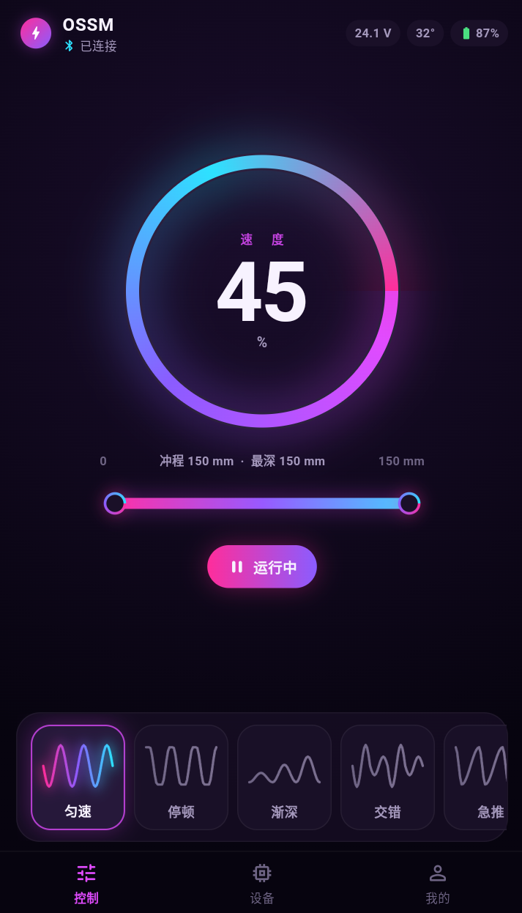

# OSSM App

Flutter 客户端，用于控制基于 OSSM 方案改造的直线往复设备。

目标硬件：ESP32-S3 + RS485 + 翼志 57AIM30（Gold Motor）。通信语义对齐官方 rad-ble 与 StrokeEngine。本仓库仅包含 App。

当前版本（0.1.0）为 UI 骨架：可在 Android 模拟器中交互，无蓝牙、无真实遥测。

---

## 界面预览

<p align="center">
  
</p>

---

## 功能状态

记录截止 2026-08-27。

### 已实现

- Android 工程，竖屏锁定
- 自定义暗色主题（非 Flutter / Material 默认样式）
- 底部导航：控制、设备、我的（`IndexedStack`，切换页不销毁控制态）
- 控制页
  - 速度圆环：相对旋转调节（顺时针增加，逆时针减少）；轻点切换运行
  - 速度量纲为 **0–100%**，对应协议 `set:speed:<0-100>`
  - 行程尺：全长表示回零后的可用行程 `_travel`；高亮区间为 `[depth − stroke, depth]`
    - 拖动区间：修改 Depth
    - 拖动左端：修改 Stroke
    - 拖动右端：修改最深点
  - 波形选择条：匀速、停顿、渐深、交错、急推、脉冲；「自定义」为占位
- 设备页、我的页：页面框架与只读占位字段

### 已回退

主屏实时波形监视器已删除（轴映射错误，且不符合产品界面预期）。波形仅保留为选择卡片上的静态缩略图。

### Mock 数据（非设备上报）

`SessionController` 当前写死以下字段，仅供排版：

| 字段 | 现值 | 正式来源 |
|---|---|---|
| `connected` | `true` | BLE 连接状态 |
| `homed` | `true` | 回零 / 软限幅标定完成 |
| `travelMm` | `150` | 固件测量的 `_travel` |
| 电压、温度、电量 | 常量 | `state` notify |
| 行程毫米值 | 百分比 × 150 | 百分比 × 实测 `_travel` |

界面已预留未标定文案，默认未启用。首次启动（未连接或未标定）不应显示 `0 … 150 mm`。

---

## 未完成

### 客户端

- [ ] 未连接 / 未标定的默认首启状态（`homed = false`，禁止启动）
- [ ] 设备页：扫描、配对、回零与软限幅标定、固件信息
- [ ] 我的页：信息架构未定
- [ ] Sensation（协议 -100…100）
- [ ] 自定义波形编辑（精确图表）；「自定义」卡片无响应
- [ ] 启动缓升 / 停止缓降（曲线在固件；客户端意图层亦未接）
- [ ] 用户速度上限
- [ ] 本地持久化（`travelMm`、上次参数）
- [ ] iOS
- [ ] 自动化测试

### 通信

- [ ] `flutter_blue_plus`
- [ ] 按 rad-ble 服务 UUID 过滤扫描
- [ ] `set:speed|stroke|depth|sensation|pattern`、`go:`、急停
- [ ] 订阅 `state`（电压、温度、故障、运行态）
- [ ] 模拟器无 BLE，联调需真机

### 固件（本仓库范围外）

固件不在本仓库。实施顺序：P0 485 → P1 点动与回原点 → P2 运动引擎 → P3 rad-ble → P5 安全与烤机。

架构约束：运动轨迹由 MCU 本地生成；无线链路只传输参数。`% → CPM / 电机指令` 的映射在固件完成。

---

## 参数模型

与 [StrokeEngine](https://github.com/theelims/StrokeEngine) 及官方 OSSM BLE 一致：

```
回零结果：     0 ════════════════════════ _travel
Depth：                                 ↑ 最深点
Stroke：                     └─────────┘ 幅度
实际往复：                   [depth − stroke, depth]
```

| 名称 | 含义 | 单位 |
|---|---|---|
| 可用行程 `_travel` | 机器测量，只读 | mm |
| Depth | 最深点，相对 `_travel` | 协议 0–100 |
| Stroke | 冲程幅度，相对 `_travel` | 协议 0–100 |
| Speed | 归一化速度 | 协议 0–100%；固件映射为 StrokeEngine CPM（次/分钟，一往复为 1） |

官方网页控制器将 Stroke / Depth / Sensation / Pattern 分 Tab 调节，速度仅回显旋钮百分比。本应用将高频控件放在同一屏，语义与协议保持一致。

---

## 构建与运行

开发环境（本机当前配置）：

- Flutter 3.47.1 / Dart 3.13.1（`H:\flutter`）
- Android SDK（`H:\android-sdk`），不依赖 Android Studio
- 调试 UI：雷电模拟器；BLE：Android 真机

```bat
set JAVA_HOME=C:\Program Files\Java\jdk-21
set ANDROID_HOME=H:\android-sdk
set ANDROID_SDK_ROOT=H:\android-sdk
set PATH=H:\flutter\bin;H:\android-sdk\platform-tools;%JAVA_HOME%\bin;%PATH%

flutter pub get
flutter devices
flutter run -d emulator-5562
```

---

## 目录结构

```
lib/
  main.dart                      入口；锁定竖屏
  screens/app_shell.dart         底栏与页面堆栈
  screens/control_screen.dart    控制
  screens/device_screen.dart     设备（占位）
  screens/profile_screen.dart    我的（占位）
  state/session_controller.dart  会话状态（Mock）
  models/stroke_pattern.dart     波形采样
  theme/                         色板与 ThemeData
  widgets/                       圆环、行程尺、波形卡、底栏
OSSM-S3-485-BLE-设计文档.md      硬件、485、BLE、运动引擎
```

---

## 参考资料

- 用户文档：https://docs.researchanddesire.com/ossm
- 网页 BLE 控制器：https://docs.researchanddesire.com/ossm/tools/web-controller
- 开发文档：https://dev.researchanddesire.com/ossm
- rad-ble：https://github.com/researchanddesire/rad-ble
- StrokeEngine：https://github.com/theelims/StrokeEngine
