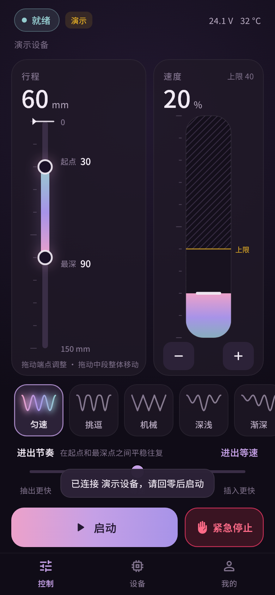
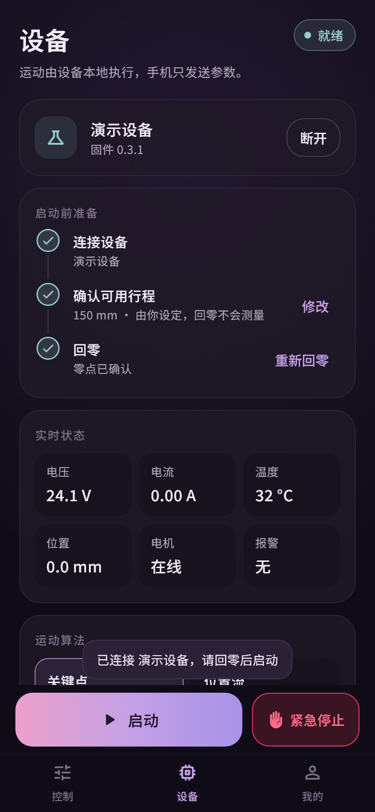

# OSSM App

Flutter Android 控制器，配套 ESP32-S3 + RS485 + 57AIM30 固件。App 0.2.1，推荐固件 0.3.1。

## 0.2.1 界面更新

三个页面与弹窗统一使用内置 Noto Sans SC 字体，统一标题、正文、说明和按钮字号；采用柔和紫色、低对比边框与圆角控件。字体按 SIL OFL 授权分发，许可随包保留在 assets/fonts/OFL.txt。预览使用同一字体，不再替换为 Windows 系统字体。

## 已实现

- BLE 服务过滤扫描、权限请求、设备发现、连接、断开及错误提示。
- rad-ble v1 JSON 信封、递增请求 ID、完成响应确认、10 秒控制租约与每 3 秒续约。
- 真实电机状态：运行、回零、电压、温度、电流、位置、总线在线和故障代码。无模拟电量。
- 旋转速度盘、行程 / 深度尺、手感 0–100（50 中性）、七种固件原生模式。
- 未连接、无控制权、状态过期、电机离线、未回零或故障时不能启动。
- 三个页面都可见的急停；停止优先，取消待发参数；设备运行态由遥测确认。
- 默认速度上限 40%、定时停止（默认 10 分钟）、默认切后台停止并断开。
- 个人参数预设与偏好保存在本机；载入预设不会自动启动。
- 独立离线演示，可体验回零 / 调参 / 启停，不创建蓝牙连接。

## 使用

1. 安装 `build/app/outputs/flutter-apk/app-release.apk`。当前使用开发签名，供本地联调。
2. 设备页扫描并选择 OSSM，允许附近设备权限；Android 11 及以下需要定位权限及系统定位服务。
3. 停机状态下确认实际可用行程，必要时修改。**回零是寻找零点，不会自动测量全行程。**
4. 清空机械行程后执行回零；等待设备确认完成。
5. 回到控制页调节速度 / 行程 / 模式，点击启动。
6. 无硬件时可在设备页启用离线演示；演示状态不会伪装成真机数据。

连接不会自动恢复运动。App 连接并取得控制权后先发送停止，之后同步状态。无线急停依赖蓝牙和固件执行，不能替代实体急停。

## 界面预览

以下为 Flutter 渲染的**演示数据**，并非硬件联调截图。





## 固件

本机实际目录是 `H:\ossm_fireware\OSSM_Fireware`（用户最初给出的 `H:\ossm\_fireware` 不存在）。本次已修改固件源码至 0.3.1：

- `state` 增加 `homed` 和 `travelMm`，BLE 启动校验已回零 / 电机在线 / 无故障。
- 回零寻找端点及回退循环支持取消；BLE 断开 / 租约失效取消回零。
- 快速重新连接不会取消正在进行的减速停止。
- 修复原缓停提前清除运行标记的问题，让安全模块完成减速后再结束运动。
- 同一运动周期内到达的启动不会覆盖待处理的停止。
- 清故障成功后复位安全状态并要求重新回零。
- `session.apply` 只更新 RAM，避免拖动滑条时高频写闪存；`setting.write` 仍按原有规则持久化。

已在 `build/firmware-validation` 的相同源码副本编译验证。未自动刷写固件或驱动真实电机。

## 协议与边界

见 [联调说明](docs/INTEGRATION.md)。以固件源码和 [rad-ble v1.0.0](https://github.com/researchanddesire/rad-ble/tree/v1.0.0) 为准；根目录旧设计文档是历史草案，部分字段和映射已过时。

当前交付 Android；没有新增 iOS 工程、OTA、手机端位置流或自绘波形。固件没有完整的自定义波形上传契约，原“自定义”空卡片已替换为真实的第七种 Insist 模式。运动策略沿用设备配置，不在普通控制页切换。

自动定时停止属于 App 会话功能；关闭“后台停止”后，操作系统挂起 App 可能导致租约过期，此时依赖固件断链停止机制。上架前需独立配置正式签名。蓝牙库使用 `License.nonprofit` 对应个人非商业开发；商业发行应遵守 [FlutterBluePlus 许可](https://pub.dev/packages/flutter_blue_plus)。

## 开发与验证

```powershell
flutter pub get
flutter analyze
flutter test
flutter build apk --release
```

Flutter / Dart：`H:\flutter`；Android SDK：`H:\android-sdk`。

- 静态分析：无问题。
- 10 项自动化测试：协议 UUID / JSON、首启与回零门禁、遥测确认、滑条合并 / 限幅、急停优先、断线 / 故障门禁、状态失效、定时停止、预设不自启、两种屏幕尺寸。
- 页面渲染检查：`flutter test tools/capture_ui_test.dart`（使用 App 内置中文字体和本机 Flutter 图标字体，供开发预览）。
- 固件：ESP32-S3 8MB 配置编译成功；未进行硬件动作验收。

## 目录

- `lib/ble/`：协议编码、真实 BLE、独立演示设备、可替换传输接口。
- `lib/state/session_controller.dart`：会话门禁、参数合并、停止、定时、持久化。
- `lib/screens/`：控制、设备、我的。
- `test/`：会话与布局测试，使用测试传输层，不操作硬件。
